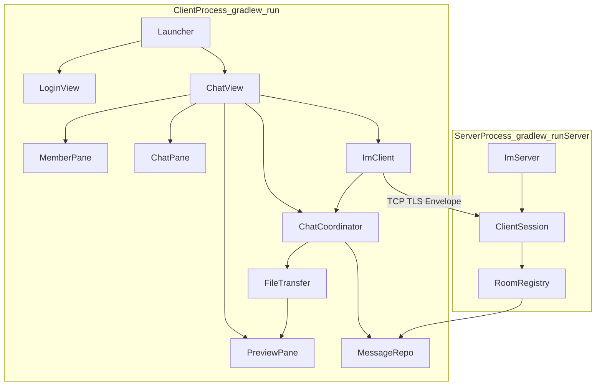
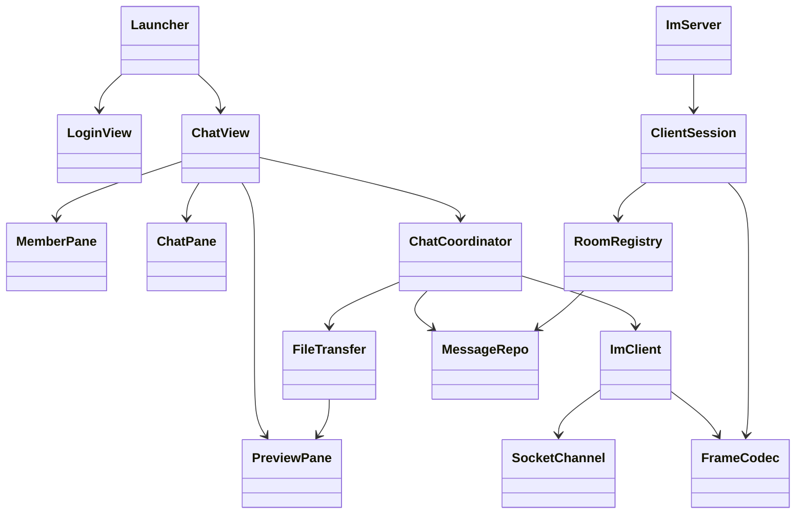

# LanIM V2 

---

## 1. 功能边界（不变）

| 项   | 决策                                                 |
| ---- | ---------------------------------------------------- |
| 拓扑 | Client → `10.129.245.252:9090` 远程服务端            |
| 房间 | 口令 → SHA-512 `roomId`，单房间                      |
| 身份 | 随机 `peerId` + 昵称，无账号                         |
| 历史 | JOIN 拉 **10** 条；服务端每房最多 **100** 条         |
| UI   | 左成员 · 中聊天 · 右最新可预览文件                   |
| 消息 | 文字 + 文件（图片以后当中间栏 inline，仍走文件通道） |
| TLS  | 默认开                                               |

---

## 2. 总体结构（一眼看懂）



**两个进程 · 各一条主线：**

- **服务端**：`ImServer` 收连接 → `ClientSession` 读帧 → `RoomRegistry` 转发/存库
- **客户端**：`ImClient` 连上并发 JOIN → 等 ACK → `ChatView` 展示；之后 inbound 全交 `ChatCoordinator` 分发

---

## 3. 包与类清单（目标 ~20 类）

```
com.alpha.lanim/
│
├── Launcher.java                 # 客户端唯一入口：JavaFX Application
│
├── ui/
│   ├── LoginView.java            # 登录 Scene（地址/昵称/口令/TLS）
│   ├── ChatView.java             # 主界面：组装三 Pane + 绑定 ImClient/Coordinator
│   ├── MemberPane.java           # 左：在线成员 ListView
│   ├── ChatPane.java             # 中：消息区 + 底栏 Send/File
│   └── PreviewPane.java          # 右：最新可预览文件（WebView/ImageView）
│
├── client/
│   ├── ImClient.java             # ★ 唯一网络类：connect、join、send、读循环
│   ├── ChatCoordinator.java      # ★ 唯一 inbound 路由：ACK/成员/聊天/文件
│   └── FileTransfer.java         # 分片收发；完成时通知 PreviewPane
│
├── server/
│   ├── ImServer.java             # 监听 9090、accept、线程池
│   ├── ClientSession.java        # 单 TCP：读帧、handleJoin/Chat/File、send
│   └── RoomRegistry.java         # 房间成员 Map、序号、relay、persist+trim
│
├── data/
│   ├── Database.java             # SQLite 初始化（原 DBUtil）
│   ├── MessageRepo.java          # insert / recent(limit) / trim(max)
│   └── FileRepo.java             # 文件元数据（原 FileDao）
│
├── model/
│   ├── Envelope.java
│   ├── MessageType.java          # JOIN, JOIN_ACK, USER_*, CHAT_TEXT, FILE_*
│   ├── JoinPayload.java
│   ├── JoinAckPayload.java
│   ├── UserEventPayload.java
│   ├── ChatPayload.java
│   ├── FileMetaPayload.java
│   ├── FileChunkPayload.java
│   └── FileChunkAckPayload.java
│
├── net/
│   ├── FrameCodec.java           # 4-byte length + JSON（原 Transport 成帧逻辑）
│   ├── SocketChannel.java        # Plain 或 TLS 封装；send/receive bytes
│   └── TlsContext.java           # 原 CertManager，证书+SSLContext
│
└── util/
    ├── Constants.java
    ├── HashUtil.java
    ├── JsonUtil.java
    └── Validator.java
```

### 3.1  deliberately 删除 / 不新建

| 旧类                                                         | 原因                                                         |
| ------------------------------------------------------------ | ------------------------------------------------------------ |
| `ClientConnectionService`, `TcpChatService`, `MessageService`, `SessionService`, `PeerService` | 合并进 `ImClient` + `ChatCoordinator`                        |
| `PeerDao`, `Peer.java`（可选删实体）                         | 在线成员仅内存，来自 JOIN_ACK / USER_*                       |
| `MainController`, `LoginController`                          | 重命名为 `ChatView`, `LoginView`                             |
| `RoomManager`, `ClientHandler`, `LanIMServer`                | 重命名为 `RoomRegistry`, `ClientSession`, `ImServer`         |
| `SyncReqPayload`, `SyncRespPayload`                          | P2P 遗留                                                     |
| `TransportFactory`, `DuplexTransport` 接口层                 | 合并为 `SocketChannel` + `FrameCodec`                        |
| `PreviewService`, `PreviewPolicy` 两个类                     | 预览规则作为 `PreviewPane` 的 static 方法或 `FileTransfer` 内 private |
| 各种 `*Service` interface                                    | 课设不做多实现，不写 interface                               |

---

## 4. 类职责与方法签名（实现清单）

### 4.1 `client.ImClient` — 客户端网络唯一出口

```java
public final class ImClient {
    public ImClient(TlsContext tls);

    /** 连接并完成 JOIN；阻塞直到 JOIN_ACK 或超时 */
    public JoinAckPayload connectAndJoin(String host, int port, boolean useTls,
            String peerId, String nickname, String roomSecret) throws Exception;

    public void send(Envelope env) throws IOException;
    public void setListener(InboundListener listener);  // 注册给 ChatCoordinator
    public void close();

    public interface InboundListener {
        void onEnvelope(Envelope env);
    }
}
```

**内部：** `SocketChannel` + 读线程循环 `FrameCodec.decode` → `listener.onEnvelope`。

---

### 4.2 `client.ChatCoordinator` — inbound 唯一路由器

```java
public final class ChatCoordinator implements ImClient.InboundListener {
    public ChatCoordinator(ImClient client, MessageRepo repo, FileTransfer files,
            MemberPane members, ChatPane chat, PreviewPane preview);

    public void onJoined(JoinAckPayload ack);   // 首次：成员+历史（也可在 onEnvelope 里处理 JOIN_ACK）
    @Override public void onEnvelope(Envelope env);

    public void sendText(String text);
    public void sendFile(Path path) throws IOException;
}
```

**switch(env.getType())：**

| type                    | 动作                                               |
| ----------------------- | -------------------------------------------------- |
| JOIN_ACK                | 写 repo；`members.refresh`；`chat.loadHistory(10)` |
| USER_JOINED             | members.add                                        |
| USER_LEFT               | members.remove                                     |
| CHAT_TEXT               | repo.insert；chat.append                           |
| FILE_META / CHUNK / ACK | 委托 FileTransfer                                  |

**不再**单独 `PeerService`：成员列表由 `MemberPane` 持 `Map<peerId,nickname>` 或简单 `List`。

---

### 4.3 `client.FileTransfer`

```java
public final class FileTransfer {
    public void send(Path file, String peerId, String roomId) throws IOException;
    public void handle(Envelope env);  // META/CHUNK/ACK
    // 收齐：FileRepo 更新 + preview.tryShow(path, mime) + chat.appendFileLine
}
```

---

### 4.4 `server.ClientSession`

```java
public final class ClientSession implements Runnable {
    public ClientSession(SocketChannel channel, RoomRegistry rooms);

    public void run();  // read loop
    public void send(Envelope env);
    private void onJoin(Envelope env);
    private void onChat(Envelope env);
    private void onFile(Envelope env);
    private void onDisconnect();
}
```

---

### 4.5 `server.RoomRegistry`

```java
public final class RoomRegistry {
    public void join(String roomId, String peerId, String nickname, ClientSession session);
    public void leave(String roomId, String peerId);
    public int nextSeq(String roomId);
    public void saveAndTrim(Envelope env);           // insert + trim(100)
    public List<Envelope> recent(String roomId, int n);
    public List<JoinAckPayload.MemberInfo> members(String roomId);
    public void broadcastExcept(String roomId, ClientSession exclude, Envelope env);
}
```

---

### 4.6 `data.MessageRepo`

```java
public final class MessageRepo {
    void insert(Envelope e);
    List<Envelope> recentByRoom(String roomId, int limit);
    void trimRoom(String roomId, int maxCount);
}
```

---

### 4.7 `ui` 三 Pane（无 Controller 层）

| 类              | 公开方法                                                     |
| --------------- | ------------------------------------------------------------ |
| **LoginView**   | `static Scene create(Stage, ConnectCallback cb)`             |
| **ChatView**    | `static Scene create(Stage, JoinAckPayload ack, ChatCoordinator coord)` |
| **MemberPane**  | `Node getNode()`；`setMembers(List<MemberRow>)`；`add/remove` |
| **ChatPane**    | `Node getNode()`；`loadHistory(List<Envelope>)`；`append(Envelope)` |
| **PreviewPane** | `Node getNode()`；`showFile(Path, String mime)`；`static boolean canPreview(mime, name)` |

**MemberRow** = `record MemberRow(String peerId, String nickname, boolean self)` 放 `model` 或 `ui` 包内。

---

### 4.8 `Launcher` 流程（无竞态）

```java
void doConnect(...) {
    runAsync(() -> {
        ImClient client = new ImClient(tls);
        ChatCoordinator coord = ...; // 先建 Pane 再 coord，或 coord 后 bind pane
        JoinAckPayload ack = client.connectAndJoin(...);
        Platform.runLater(() -> stage.setScene(ChatView.create(stage, ack, coord)));
    });
}
```

**关键：** `connectAndJoin` **返回 ACK 后再** `setScene`，成员/历史一次到位。

---

## 5. 类关系图



---

## 6. 与旧仓库迁移对照

| 旧                       | 新                                 |
| ------------------------ | ---------------------------------- |
| `bll/` 整包              | `client/` 3 类                     |
| `server/RoomManager`     | `server/RoomRegistry`              |
| `server/ClientHandler`   | `server/ClientSession`             |
| `server/LanIMServer`     | `server/ImServer`                  |
| `dal/DBUtil`             | `data/Database`                    |
| `dal/MessageDao`         | `data/MessageRepo`                 |
| `ui/MainController`      | `ui/ChatView` + 3 Pane             |
| `bll/transport/*`        | `net/SocketChannel` + `FrameCodec` |
| `bll/crypto/CertManager` | `net/TlsContext`                   |

**Gradle：** `mainClass` 仍 `Launcher`；`runServer` → `server.ImServer`。

---

## 7. 实现顺序（手动重构建议）

1. `model` + `net.FrameCodec` + `util.Constants`
2. `data.Database` + `MessageRepo`（含 recent/trim）
3. `server.*` 三件套，本机双终端测 JOIN/聊天
4. `client.ImClient` + `ChatCoordinator`（CLI 或临时 main 测 ACK）
5. `ui.LoginView` + 三 Pane + `ChatView`
6. `FileTransfer` + `PreviewPane`
7. 删旧包 `bll/`、废弃类，改 `build.gradle` 如有需要

---

## 8. 常量（写入 Constants.java）

```java
DEFAULT_SERVER_HOST = "10.129.245.252";
DEFAULT_SERVER_PORT = 9090;
JOIN_HISTORY_LIMIT = 10;
ROOM_MESSAGE_CAP = 100;
FILE_CHUNK_SIZE = 65536;
DEFAULT_DB_PATH = "data/lanim.db";
```

---

*V2 简洁版：client/server 分包，2+3+5 核心类（client 3 + server 3 + ui 5），无 interface、无 PeerDao、无多层 Service。*
